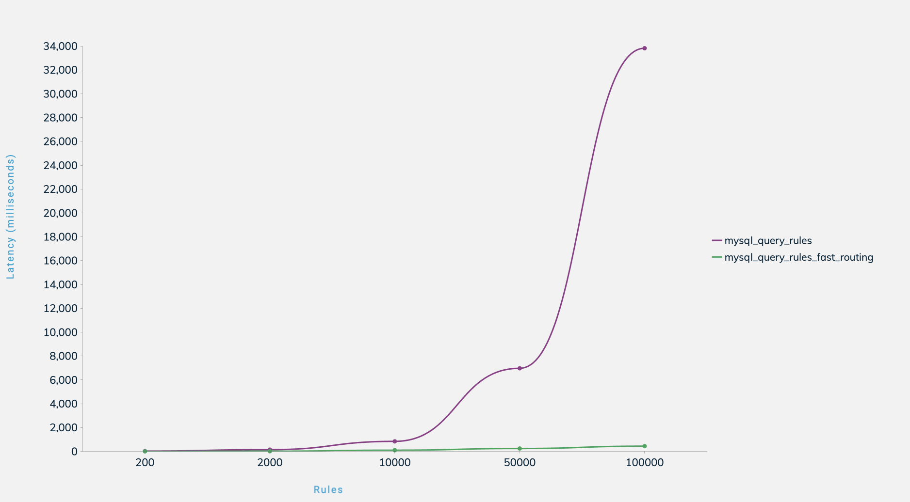
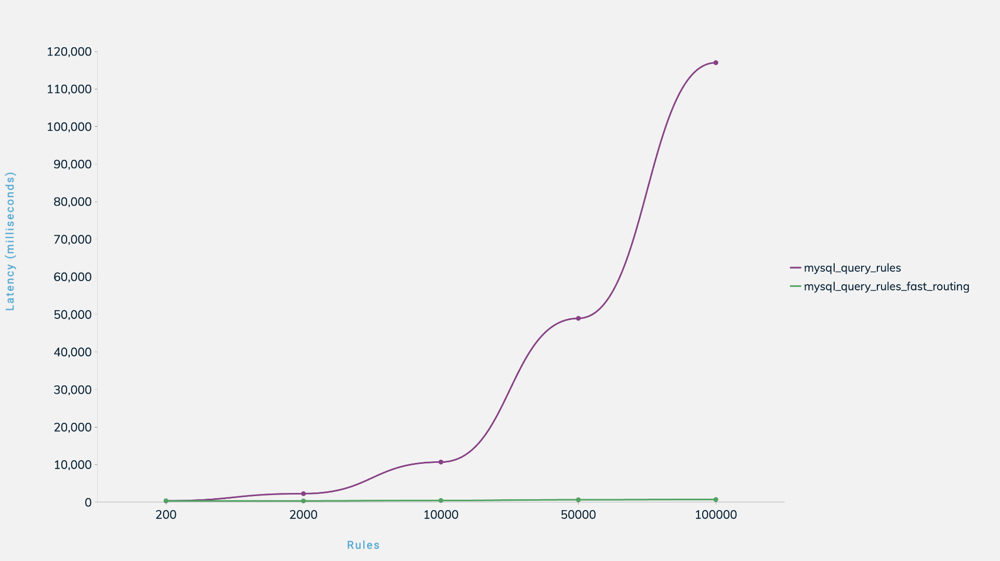

# local-proxysql-setup
ProxySQL on Kubernetes

Tools used for sample deployment:

- podman (works for m1)
- Kubectl
- Minikube
- Helm

### Installing Helm

#### Detailed install

- https://helm.sh/docs/intro/install/

## Configuring environment

### Minikube

Install minikube, podman and podman-desktop

```
brew install minikube
brew install podman
brew install podman-desktop
```

Configure podman:

```
podman machine init --cpus 2
podman machine set --rootful
podman machine start
Starting machine "podman-machine-default"
Waiting for VM ...
Mounting volume... /Users:/Users
Mounting volume... /private:/private
Mounting volume... /var/folders:/var/folders
API forwarding listening on: /Users/me/.local/share/containers/podman/machine/podman-machine-default/podman.sock

The system helper service is not installed; the default Docker API socket
address can't be used by podman. If you would like to install it run the
following commands:

	sudo /opt/homebrew/Cellar/podman/4.4.2/bin/podman-mac-helper install
	podman machine stop; podman machine start

You can still connect Docker API clients by setting DOCKER_HOST using the
following command in your terminal session:

	export DOCKER_HOST='unix:///Users/me/.local/share/containers/podman/machine/podman-machine-default/podman.sock'

Machine "podman-machine-default" started successfully
```
Configure minikube:

```
minikube config set memory 6144
minikube config set cpus 2
minikube config set disk-size 50000MB
minikube config set vm-driver podman
```

minikube need to be started with podman driver and por forfarding to localhost

```
➜  ~ minikube start --driver=podman --ports=127.0.0.1:30080:30080
😄  minikube v1.29.0 on Darwin 13.2 (arm64)
❗  Both driver=podman and vm-driver=podman have been set.

    Since vm-driver is deprecated, minikube will default to driver=podman.

    If vm-driver is set in the global config, please run "minikube config unset vm-driver" to resolve this warning.

✨  Using the podman (experimental) driver based on user configuration
❗  With --network-plugin=cni, you will need to provide your own CNI. See --cni flag as a user-friendly alternative
📌  Using Podman driver with root privileges
👍  Starting control plane node minikube in cluster minikube
🚜  Pulling base image ...
💾  Downloading Kubernetes v1.26.1 preload ...
    > preloaded-images-k8s-v18-v1...:  359.07 MiB / 359.07 MiB  100.00% 7.46 Mi
E0404 14:19:40.542670   64028 cache.go:188] Error downloading kic artifacts:  not yet implemented, see issue #8426
🔥  Creating podman container (CPUs=2, Memory=1955MB) ...
🎁  Preparing Kubernetes v1.26.1 on CRI-O 1.24.4 ...
E0404 14:21:25.412511   64028 start.go:131] Unable to get host IP: RoutableHostIPFromInside is currently only implemented for linux
    ▪ Generating certificates and keys ...
    ▪ Booting up control plane ...
    ▪ Configuring RBAC rules ...
🔗  Configuring Cilium (Container Networking Interface) ...
    ▪ Using image gcr.io/k8s-minikube/storage-provisioner:v5
🔎  Verifying Kubernetes components...
🌟  Enabled addons: storage-provisioner, default-storageclass
🏄  Done! kubectl is now configured to use "minikube" cluster and "default" namespace by default
```

```
minikube status
```

### Add dashboard

Start minikube dashboard:

```
➜  ~ minikube dashboard --url

kubectl apply -f https://raw.githubusercontent.com/kubernetes/dashboard/v2.0.0/aio/deploy/recommended.yaml
minikube addons enable dashboard

# Get dashboard URL (ctrl+c to exit if stuck)
➜  ~ minikube dashboard
🔌  Enabling dashboard ...
    ▪ Using image docker.io/kubernetesui/dashboard:v2.7.0
    ▪ Using image docker.io/kubernetesui/metrics-scraper:v1.0.8
💡  Some dashboard features require the metrics-server addon. To enable all features please run:

	minikube addons enable metrics-server


🤔  Verifying dashboard health ...
🚀  Launching proxy ...
🤔  Verifying proxy health ...
🎉  Opening http://127.0.0.1:61172/api/v1/namespaces/kubernetes-dashboard/services/http:kubernetes-dashboard:/proxy/ in your default browser...
```

## Deploying with Helm

### Install MySQL with bitnami charts

Note: You can configure custom settings (root password / number of slaves / etc. in mysql/values.yaml

```
helm repo add bitnami https://charts.bitnami.com/bitnami
helm install mysql-8 -f ./mysql/values.yaml bitnami/mysql

# Get password for MySQL
echo Password : $(kubectl get secret --namespace default mysql-8 -o jsonpath="{.data.mysql-root-password}" | base64 --decode)
Password : root
```

#### Deploy ProxySQL 

##### Install ProxySQL

```
helm install proxysql-cluster-controller ./proxysql-cluster-controller
helm install proxysql-cluster-passive ./proxysql-cluster-passive
```

##### Change settings and re-deploy

```
vi proxysql-cluster-controller/files/proxysql.cnf 
helm upgrade proxysql-cluster-controller ./proxysql-cluster-controller

vi pproxysql-cluster-passive/files/proxysql.cnf 
helm upgrade proxysql-cluster-passive ./proxysql-cluster-passive
```

Optionally do a rolling restart (note, templates are configured to re-deploy on configmap changes, i.e. this step is not required unless configmap checksum is removed)

```
kubectl rollout restart deployment/proxysql-cluster-controller
kubectl rollout restart deployment/proxysql-cluster-passive
```

##### Delete `proxysql-cluster` deployment

```
helm delete proxysql-cluster-controller
helm delete  proxysql-cluster-passive
```

##### Connect to ProxySQL 

```
mysql -h127.0.0.1 -P32760 -uroot -proot
```

## Useful commands

### Helm

```
helm install <releasename> <path>
helm upgrade <releasename> <path>
helm delete <releasename>
```

### Kubectl

```
kubectl get services
kubectl get pods
kubectl get deployment
kubectl get pods --all-namespaces
kubectl describe service <servicename>
kubectl rollout restart deployment/proxysql-cluster
KUBE_EDITOR="nano" kubectl edit svc -n default proxysql-cluster-controller
```

### Podman

```
podman ps -a --pod
podman port minikube
podman info
podman network ls
podman machine stop
podman machine start
```

### Minicube

```
minikube start
minikube delete
```
## Testing locally difference in performance mysql_query_rules vs mysql_query_rules_fast_routing

To understand the performance implication of performing routing based on the number of rules. For every test, we configured ProxySQL setting the right number of rules: for 100 schemas we created 100 rules, for 1000 schema 1000 rules, etc.

At the end for run-test.sh script we are computing the value of status variable Query_Processor_time_nsec.

Query_Processor_time_nsec : the time spent inside the Query Processor to determine what action needs to be taken with the query (internal module)

### Locala machine

Used for this test 4 cores of cpu and 2GB of memmroy:

```
➜  ~ podman stats -a --no-stream
ID            NAME        CPU %       MEM USAGE / LIMIT  MEM %       NET IO             BLOCK IO      PIDS        CPU TIME      AVG CPU %
0a599374e5af  minikube    16.91%      1.648GB / 2.048GB  80.49%      904.3MB / 366.5MB  0B / 72.19kB  673         42m6.208418s  16.91%
```

Test results are following (numbers in milliseconds):

```
Rules	                        200	2000	10000	50000	100000
mysql_query_rules	         23	143	    837	    6967	33816
mysql_query_rules_fast_routing	0.3	12	    97	    239	    435
```

Got the graph:



### Machine in GCP

Used 3 configured databases on n2d-standard-4 machine type (prod like env):

```
➜  ~ gcloud compute instances list --project bigcommerce-staging --filter "(name ~ '^db-store-test-.*')"
NAME                           ZONE           MACHINE_TYPE    PREEMPTIBLE  INTERNAL_IP    EXTERNAL_IP  STATUS
db-store-test-master-f0b42c11  us-central1-a  n2d-standard-4               10.133.64.192               RUNNING
db-store-test-read-71b8f954    us-central1-a  n2d-standard-4               10.133.64.193               RUNNING
db-store-test-master-62a08f14  us-central1-b  n2d-standard-4               10.133.64.191               RUNNING
```

And two proxysql servers, to check if replication of rules works or not:

```
➜  ~ gcloud compute instances list --project bigcommerce-staging --filter "(name ~ '^proxysql-test-.*')"
NAME                ZONE           MACHINE_TYPE    PREEMPTIBLE  INTERNAL_IP    EXTERNAL_IP  STATUS
proxysql-test-dwgh  us-central1-c  n2d-standard-2               10.133.64.156               RUNNING
proxysql-test-zbkr  us-central1-f  n2d-standard-2               10.133.64.124               RUNNING
```

Test results for GCP are:

```
Rules	                        200	2000	10000	50000	100000
mysql_query_rules	            396	2300	10706	48960	117007
mysql_query_rules_fast_routing	372	377	    489	    674	    731
```

Also the graph::



## Conclusion:

- Around 10000 rules latency is growing up normal for simple mysql_query_rules, after its dramatically increases
- mysql_query_rules_fast_routing for up to 10000 shards introducing less latency the mysql_query_rules routing algorithm, and it scales very well to 100k rules wth very small overhead
- Minikube good local tool to build local performance test with different proxysql/mysql version before it's goes to enother enviropments

### Useful links

- https://www.youtube.com/watch?v=UCvgHO9TtMs
- https://proxysql.com/blog/new-schemaname-routing-algorithm/
- https://github.com/bitnami/charts
- https://www.percona.com/blog/proxysql-rules-do-i-have-too-many/